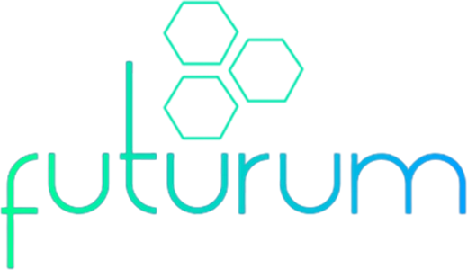

# Semester Project 1 | Futurum

First Exam at Noroff. We were to use our new knowledge of coding and UX design to create a homepage for a new "fictive" museum opening in our city. Our target were families and children who would like a place to learn after school.

## Description

Our task was to create a homepage for a new "fictive" museum opening in our city. Our target were families and children who would like a place to learn after school. We were not allowed to use any Javascript, frameworks or libaries. The main focus was overall design, flow and that the page was fully responsive.

## Built With

- HTML
- CSS

## Getting Started

### Installing

This is where you list how to get the project started. It typically just includes telling a person to clone the repo and then to install the dependencies e.g.

1. Clone the repo:

- https://github.com/Miksel90/Semester-project-1.git

### Running

It does not require anything to get started. Its a simple website.

## Contributing

Simply open a pull request so code can be reviewed.

## Contact

This is where you can leave your social links for people to contact you, such as a LinkedIn profile or Twitter link e.g.

Facebook

- Mikael Selstad

Instagram

- @MikaBjrk

My LinkedIn page

- linkedin.com/in/mikael-selstad-921251279
